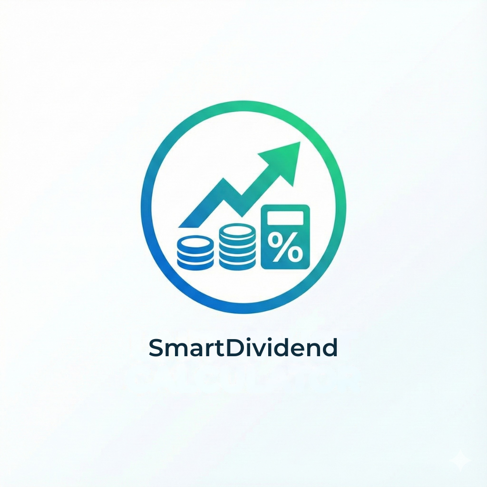
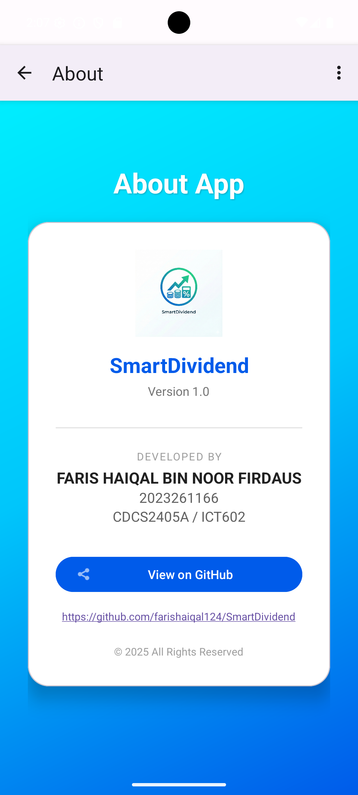

# SmartDividend 💰
> A Mobile Application for Unit Trust Dividend Calculation

*(Note: If the image doesn't load here, check the "Screenshots" section below)*

## 📋 Table of Contents
* [About the App](#about-the-app)
* [Student Information](#student-information)
* [Features](#features)
* [Screenshots](#screenshots)
* [Installation](#installation)
* [Requirements](#requirements)

---

## 📱 About the App
**SmartDividend** is a native Android application designed to help investors calculate their returns from Unit Trust investments. It was developed as an individual assignment for the **Mobile Technology and Development** course.

The app accurately calculates:
1.  **Monthly Dividend:** `(Annual Rate / 12) × Invested Fund`
2.  **Total Dividend:** `Monthly Dividend × Duration (Months)`

It features a modern, responsive "Mobile First" UI built with Material Design components.

---

## 👨‍🎓 Student Information
| Field | Detail                                        |
| :--- |:----------------------------------------------|
| **Name** | Faris Haiqal Bin Noor Firdaus                 |
| **Matric No** | 2023261166                                    |
| **Course Code** | ICT602                                        |
| **Faculty** | Faculty of Computer and Mathematical Sciences |
| **University** | Universiti Teknologi MARA (UiTM)              |

---

## ✨ Features
* **Smart Calculation:** Instant processing of investment formulas.
* **Input Validation:** Ensures months do not exceed 12 and fields are not empty.
* **Modern UI:** Features a gradient background, card-based layout, and animations.
* **Responsive Design:** Optimized for various mobile screen sizes.
* **Navigation:** Functional "About" page with developer details and GitHub integration.

---

## 📸 Screenshots

| Home Screen | Result & Validation | About Page |
| :---: | :---: | :---: |
|  |  |  |

*(Note to Lecturer: Please see the `screenshots` folder if images do not render).*

---

## ⬇️ Installation
You can download the latest stable version (APK) from the Releases page:
[**Download SmartDividend v1.0**](https://github.com/farishaiqal124/SmartDividend/releases)

---

## 🛠 Requirements
* **Android Version:** Android 7.0 (Nougat) or higher.
* **Internet:** Not required for calculation (Offline capable).

---

## © Copyright
© 2025 FARIS HAIQAL BIN NOOR FIRDAUS. All Rights Reserved.